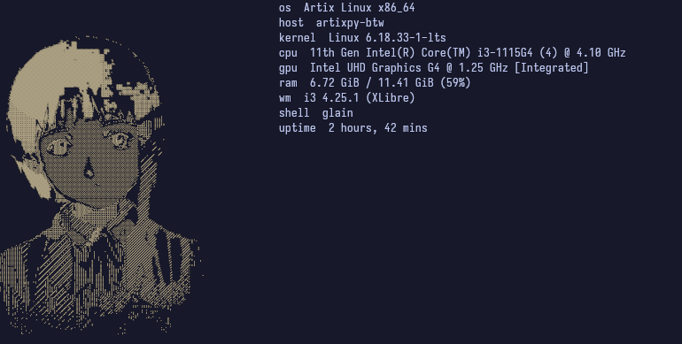

<div align="center">

# glain

**fastfetch + lain gifs written in Go**



*inspired by [fetchlains](https://github.com/Linuxdrito/fetchlains) by [Linuxdrito](https://github.com/Linuxdrito)*


</div>

---

## about

glain is a rewrite in Go of [fetchlains](https://github.com/Linuxdrito/fetchlains) by [Linuxdrito](https://github.com/Linuxdrito). the original idea, architecture, and GIFs are his — this is just a Go port with some additions.

the core idea: run `fastfetch` and pick a random Lain GIF **in parallel**, then render the GIF next to your system info using `timg`.

- goroutine launches fastfetch in the background while the GIF is selected
- terminal protocol is auto-detected (kitty, sixel, etc.)
- `syscall.Exec` replaces the process with timg — no fork, no zombie process
- GIFs, index and margin are configurable via flags

---

## dependencies

- `fastfetch`
- `timg`
- `go` >= 1.21

### install dependencies on Arch Linux

```bash
# fastfetch
sudo pacman -S fastfetch

# timg
sudo pacman -S timg

# go
sudo pacman -S go

# kitty (recommended terminal)
sudo pacman -S kitty
```

> if `timg` is not available in your repos, install it from AUR:
> ```bash
> yay -S timg
> # or
> paru -S timg
> ```

---

## install

```bash
git clone https://github.com/JuanPerdomo00/glain
cd glain
go build -o glain .
sudo mv glain /usr/local/bin/glain
```

---

## setup

```bash
mkdir -p ~/.config/glain/gifs

# copy your gifs
cp gifs/* ~/.config/glain/gifs/

# copy the gif index
cp .gif-index ~/.config/glain/.gif-index

# create the margin file (whitespace that reserves space for the GIF)
cp margin.txt  ~/.config/glain/margin.txt
```

### gif-index format

one gif per line: `name.gif:width:height`

```
lain1.gif:35:35
lain2.gif:35:35
lain10.gif:35:35
```

---

## usage

```bash
glain
```

with custom paths:

```bash
glain -gifs ~/mygifs -index ~/.gif-index -margin ~/margin.txt
```

### flags

| flag | default | description |
|---|---|---|
| `-gifs` | `~/.config/glain/gifs` | directory with GIF files |
| `-index` | `~/.config/glain/.gif-index` | gif index file |
| `-margin` | `~/.config/glain/margin.txt` | margin file for fastfetch |

---

## autostart

### zsh / bash

add to your `~/.zshrc` or `~/.bashrc`:

```bash
glain
```

### kitty

```conf
# ~/.config/kitty/kitty.conf
startup_session ~/.config/kitty/default_session.kitty
```

```
# ~/.config/kitty/default_session.kitty
launch glain
```

### i3

bind a key to open a terminal and run glain in `~/.config/i3/config`:

```conf
# open a floating terminal with glain on $mod+g
bindsym $mod+g exec --no-startup-id kitty --class glain glain

# make it float automatically
for_window [class="glain"] floating enable, resize set 700 400
```

or run it on startup as a scratchpad:

```conf
exec --no-startup-id kitty --class glain glain
for_window [class="glain"] move scratchpad
bindsym $mod+g [class="glain"] scratchpad show
```

---

## terminal support

| terminal | protocol | animated |
|---|---|---|
| kitty | kitty | ✅ |
| foot | sixel | ✅ |
| wezterm | kitty | ✅ |
| ghostty | quarter | ❌ |

> best experience with **kitty** terminal

---

## fastfetch config

glain works best with a minimal fastfetch config. set `"source": "none"` in your logo section — glain handles the logo itself via the margin file.

example minimal config at `~/.config/fastfetch/config.jsonc`:

```json
{
  "logo": { "source": "none" },
  "display": {
    "separator": "  ",
    "color": {
      "keys":   "38;2;180;160;210",
      "output": "38;2;200;185;220"
    }
  },
  "modules": [
    { "key": " os",     "type": "os" },
    { "key": " host",   "type": "title", "format": "{host-name}" },
    { "key": " kernel", "type": "kernel" },
    { "key": " cpu",    "type": "cpu" },
    { "key": " gpu",    "type": "gpu" },
    { "key": " ram",    "type": "memory" },
    { "key": " wm",     "type": "wm" },
    { "key": " shell",  "type": "shell" },
    { "key": " uptime", "type": "uptime" }
  ]
}
```

---

## credits

- original concept and GIFs by **[Linuxdrito](https://github.com/Linuxdrito)** — [fetchlains](https://github.com/Linuxdrito/fetchlains)

---

## license

glain is licensed under the [GNU General Public License v3.0](LICENSE).

s


